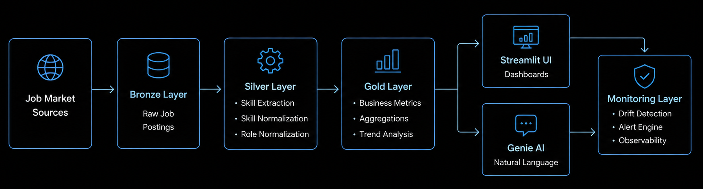
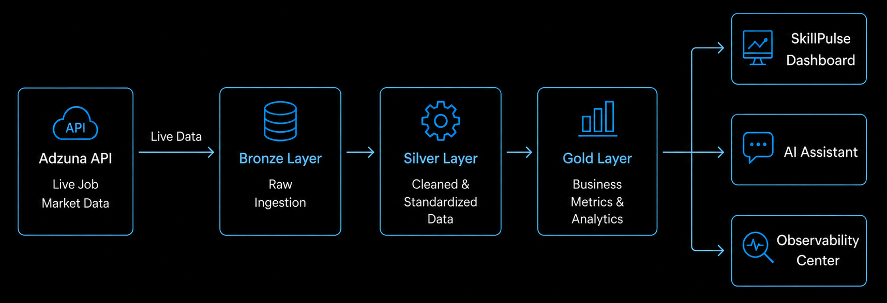
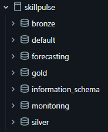
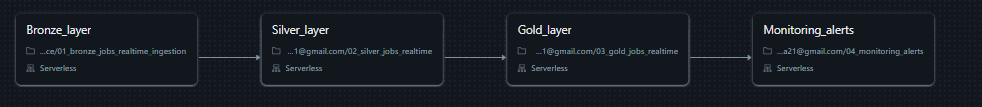
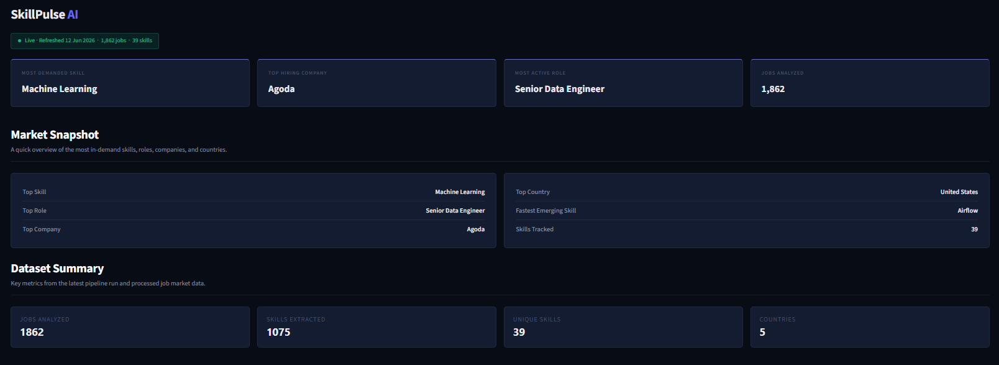
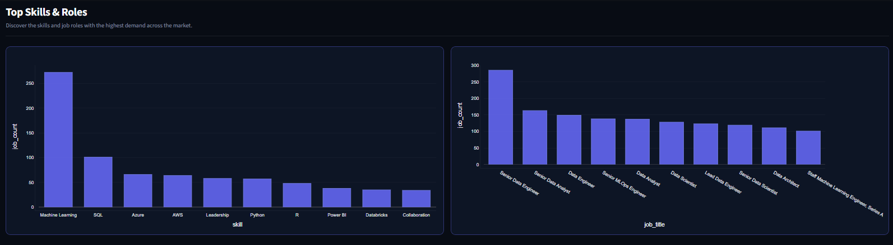
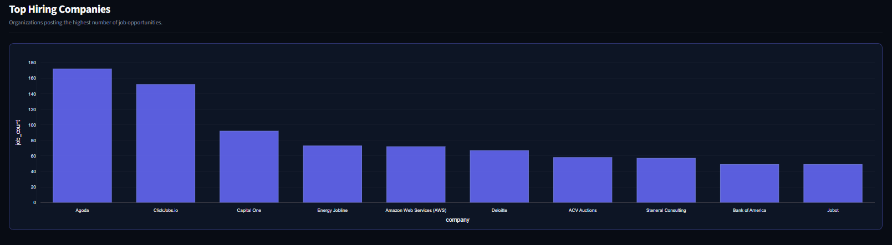
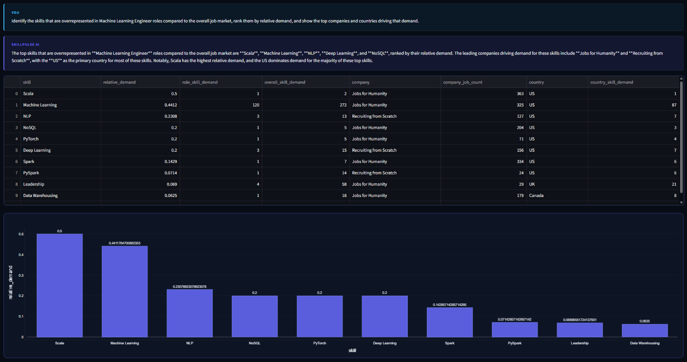
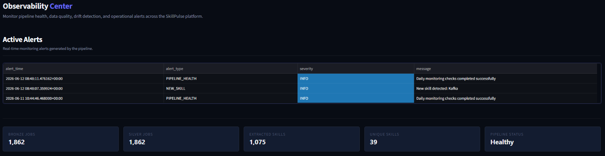

# SkillPulse AI

SkillPulse AI is a real-time workforce intelligence platform built on the Databricks Lakehouse Platform that helps professionals, students, and organizations identify high-demand skills, emerging technologies, hiring trends, and workforce opportunities.

The platform continuously ingests live job market data, transforms it through a Medallion Architecture (Bronze → Silver → Gold), and delivers actionable insights through an interactive analytics dashboard, AI-powered querying, and operational observability.

---

## Objective

The rapid pace of technological change makes it difficult for individuals and organizations to understand which skills are truly in demand.

SkillPulse AI was built to solve this problem by providing:

- Real-time job market intelligence
- Skill demand analytics
- Hiring trend analysis
- Geographic demand insights
- AI-powered workforce exploration
- Pipeline observability and monitoring

The platform is designed for:

### Students & Freshers

- Identify the most in-demand skills
- Understand market expectations
- Make data-driven learning decisions
- Track emerging technologies

### Working Professionals

- Upskill based on actual market demand
- Benchmark skills against industry trends
- Explore hiring patterns across companies

### Organizations

- Understand workforce demand
- Monitor industry hiring trends
- Analyze skill gaps
- Support talent planning initiatives

---

# Architecture

The platform is built entirely on Databricks using a modern Lakehouse architecture.

### Data Flow

---

# Databricks Lakehouse Architecture

The project follows the Medallion Architecture pattern to ensure scalability, maintainability, and data quality.

### Bronze Layer

Stores raw job market records as received from source systems.

### Silver Layer

Applies data cleansing, standardization, enrichment, and normalization.

### Gold Layer

Produces business-ready datasets for:

- Skill Demand Analytics
- Company Analytics
- Country Analytics
- Role Analytics
- Pipeline Monitoring

### Monitoring Layer

Tracks:

- Pipeline executions
- Data quality metrics
- Alert events
- Operational health

---

# Databricks Workflow Orchestration

The entire pipeline is automated using Databricks Workflows.

The workflow executes:

1. Bronze Ingestion
2. Silver Transformation
3. Gold Aggregation
4. Monitoring & Alert Generation

This ensures all analytics remain synchronized with the latest available market data.

---

# Dashboard Overview

The dashboard provides a consolidated view of workforce intelligence metrics.

Key metrics include:

- Jobs Analyzed
- Skills Extracted
- Unique Skills Identified
- Countries Covered
- Most Demanded Skills
- Most Active Roles
- Top Hiring Companies

---

# Skills & Role Analytics

Analyze which skills and job roles currently dominate the job market.

Capabilities include:

- Skill demand ranking
- Role popularity analysis
- Emerging skill detection
- Workforce trend monitoring

---

# Market Intelligence

Explore hiring demand across organizations and countries.

Provides visibility into:

- Top hiring organizations
- Geographic demand distribution
- Regional skill requirements
- Market opportunities

---

# AI-Powered Workforce Assistant

SkillPulse AI includes a natural-language analytics assistant powered by Databricks Genie.

Users can ask complex business questions such as:

> Identify the skills that are overrepresented in Machine Learning Engineer roles compared to the overall job market, rank them by relative demand, and show the top companies and countries driving that demand.

The assistant automatically:

- Generates analytical queries
- Retrieves workforce insights
- Produces structured outputs
- Visualizes results

without requiring SQL knowledge.

---

# Observability & Monitoring

Operational reliability is a first-class component of the platform.

The observability layer tracks:

### Pipeline Health

- Jobs processed
- Skills extracted
- Refresh status
- Processing trends

### Alert Engine

Automatically records operational alerts for:

- Pipeline failures
- Data quality issues
- Volume anomalies
- Monitoring events

### Historical Monitoring

Maintains execution history for trend analysis and operational audits.

---

# Lakehouse Monitoring

The platform leverages Databricks Lakehouse Monitoring capabilities to support data quality and drift detection.

Key monitoring capabilities include:

- Data profiling
- Data quality tracking
- Schema monitoring
- Drift detection readiness
- Historical metric collection

---

# Technology Stack

## Data Platform

- Databricks Lakehouse Platform
- Delta Lake
- Unity Catalog
- Databricks Workflows
- Databricks SQL Warehouse
- Databricks Genie
- Lakehouse Monitoring

## Backend

- Python
- Pandas
- SQL

## Frontend

- Streamlit
- Plotly

## Observability

- Custom Monitoring Layer
- Alert Engine
- Pipeline Health Tracking

---

# Key Features

### Real-Time Workforce Intelligence

Continuously updated workforce analytics powered by live market data.

### Databricks-Native Architecture

Built entirely using Databricks Lakehouse best practices.

### AI-Powered Exploration

Natural language workforce analytics through Databricks Genie.

### Operational Monitoring

Integrated observability and alerting framework.

### Scalable Data Pipeline

Production-style Medallion Architecture supporting future expansion.

---

# Future Enhancements

Planned roadmap items include:

- **Time-series demand forecasting**
- Skill demand prediction models
- Automated anomaly detection
- Workforce trend forecasting
- Personalized upskilling recommendations
- Advanced drift monitoring

---

# Author

Shreya Saihgal

SkillPulse AI demonstrates how real-time workforce data can be transformed into actionable career and talent intelligence using the Databricks Lakehouse Platform.
